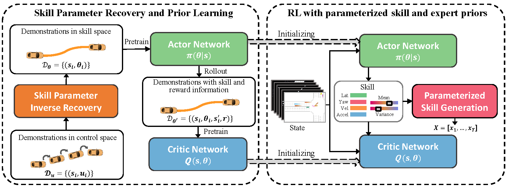

# Efficient Reinforcement Learning for Autonomous Driving with Parameterized Skills and Priors

> Letian Wang, Jie Liu, Hao Shao, Wenshuo Wang, RuoBing Chen, Yu Liu, Steven L. Waslander
> [RSS 2023](http://arxiv.org/abs/2305.04412)

This repository contains code for the paper [Efficient Reinforcement Learning for Autonomous Driving with Parameterized Skills and Priors](http://arxiv.org/abs/2305.04412), which is accpeted by RSS 2023.

This work presents an efficient reinforcement learning (ASAP-RL) that simultaneously leverages parameterized motion skills and expert priors for autonomous vehicles to navigate in complex dense traffic. This work first introduce parameterized motion skills and enable RL agents to learn over the skill parameter space instead of the control space. To further leverage expert priors on top of skills, this work then proposes an inverse skill parameter recovery technique to convert expert demonstrations from control space to skill space. A simple but effective double initialization technique to better leverage expert priors. Validations on three challenging dense-traffic driving scenarios demonstrate that the proposed ASAP-RL significantly outperforms previous methods in terms of learning efficiency and performance.

This repo also includes code for compared baselines in the paper (SAC, PPO, Constant SAC), and methods in paper [Accelerating Reinforcement Learning for Autonomous Driving using Task-Agnostic and Ego-Centric Motion Skills](https://arxiv.org/abs/2209.12072), and [Accelerating Reinforcement Learning with Learned Skill Priors](https://arxiv.org/abs/2010.11944).


If you find our repo or paper useful, please cite our work as:

```bibtex
@misc{wang2023efficient,
    title={Efficient Reinforcement Learning for Autonomous Driving with Parameterized Skills and Priors}, 
    author={Letian Wang and Jie Liu and Hao Shao and Wenshuo Wang and Ruobing Chen and Yu Liu and Steven L. Waslander},
    journal={arXiv preprint arXiv:2305.04412},
    year={2023}
}

@article{zhou2022accelerating,
  title={Accelerating Reinforcement Learning for Autonomous Driving using Task-Agnostic and Ego-Centric Motion Skills},
  author={Zhou, Tong and Wang, Letian and Chen, Ruobing and Wang, Wenshuo and Liu, Yu},
  journal={arXiv preprint arXiv:2209.12072},
  year={2022}
}
```

# Demo Video


# Contents
1. [Setup](#setup)
2. [RL Training](#RL-Training)
3. [visualization and evaluation](#visualization-and-evaluation)
4. [expert data collection](#expert-data-collection)
5. [expert skill parameter recovery](#expert-skill-parameter-recovery)
6. [Actor and critic pretraining](#Actor-and-critic-pretraining)

# Setup
Install anaconda
```Shell
wget https://repo.anaconda.com/archive/Anaconda3-2020.11-Linux-x86_64.sh
bash Anaconda3-2020.11-Linux-x86_64.sh
source ~/.profile
```

Clone the repo and build the environment

```Shell
conda create -n asaprl python=3.7
conda activate asaprl
pip install -r requirements.txt
cd ASAPRL
pip install . 
```

The experiments are conducted on the MetaDrive simulator, and we use DI-engine to implement some baseline RL methods (SAC, PPO) and manage the multi-process to collect data with multiple environments asynchronously.

# RL training
See the training commands in the directory ```launch_command/training_commands``` to reproduce the experiments in the paper. The directory indluces files below:
1. highway: commands to run the comparison experiments on the highway scenario
2. intersection: commands to run the comparison experiments on the intersection scenario
3. roundabout: commands to run the comparison experiments on the roundabout scenario
4. abl_length: commands to run the ablation studies of the skill length
5. abl_prior: commands to run the ablation studies of the expert length

The training logs will be stored at ```log```. The ckpt and training configures for each experiment with ```experiment_name```  will be saved at ```/saved_model/experiment_name```. The pretrained 

Note that the experiments in the paper are run on powerful servers, where we are able to conduct asynchronous parallel data collection. Specifically, for each experiment we typically launch 12 simulation environments for collection, and 2 simulation environments for evaluation, and we also set a large replay buffer size and data collection each time, where a memory of around 150G is used to store the replay buffer. In the code provided, we reduced the relavant parameters to avoid computer freeze for first users with limited resources. If you are reproducing the results in the paper, you will need to increase the environment number, replay buffer size, and data collection size by modifying the parameter ```n_evaluator_episode```, ```collector_env_num```, ```evaluator_env_num```, ```replay_buffer_size```, ```n_sample``` in the launched python file. The original parameters used in our experiments are commented on at the end of the corresponding parameter line.

We will soon release the pretrained models needed for some methods (SPiRL, TaEcRL, and our full-version ASAP-RL), and some of the trained model. But for our ASAP-RL, you are still able to run the no-prior version with the current code. We'll update the pretrained models in the directory of ```pretrain_ckpt_files```.

# visualization and evaluation
See the commands in the directory ```launch_command/eval_commands``` to visualize or evaluate the trained agent. The directory indluces files below:
1. highway: commands to evaluate/visualize trained agent on the highway scenario
2. intersection: commands to evaluate/visualize trained agent on the intersection scenario
3. roundabout: commands to evaluate/visualize trained agent on the roundabout scenario
4. abl_length: commands to evaluate/visualize trained ablation methods on the roundabout scenario
5. abl_prior: commands to evaluate/visualize trained ablation methods on the roundabout scenario

Note that you will need to modify the argparse parameter ```exp_name``` and ```ckpt_file``` according to which trained agent and the saved model you are visualizing or evaluating.

The files in ```src/training``` are used for training and ```src/evaluation``` are used for evaluation. Files in these two directories are basically similar, except for the fact that 1) files in ```src/evaluation``` will turn on the MetaDrive rendering by setting the config parameter ```use_render``` as on; 2) files in ```src/evaluation``` only includes the evaluator, without the collector and learner. 3) files in ```src/evaluation``` requires you to specify the ```ckpt_file```


# expert data collection
See the commands in the directory ```launch_command/data_collection_commands``` to collect data. The directory indluces files below:
1. rl_agent: collect data with trained RL agent on three scenarios. Specifically, the RL agent we used is the 'No Prior' version of our method, since it has higher performance than typical RL method such as SAC/PPO. The collected data will be stored at ```demonstration_RL_expert/scenario/```.
2. rule_expert_agent: collect data with hand-designed rule-based agent on three scenarios, collected data will be stored at ```demonstration_RL_expert/scenario/```


# expert skill parameter recovery
See the commands in the directory ```launch_command/skill_recovery_commands``` to recover skill parameters in the collected expert demonstrations. The directory indluces files below:
1. skill recovery: read collected expert demonstration, recover skill parameters for the expert data, store the recovered data at  at ```demonstration_RL_expert/scenario_annotated/```


# Actor and critic pretraining
See the commands in the directory ```launch_command/prior_training``` to pretrain the actors. The directory indluces files below:
1. actor_pretraining: pretrain the actor network with the expert data. Note that since the collected data has the ground-truth skill parameters, this 1) enable us to examine the accuracy of the recovered parameters; 2) train with both ground-truth skill parameters and recovered skill parameters, to tell their differences. The trained actor will be respectively saved in ```saved_model/pretrain_actor``` and ```saved_model/pretrain_actor_gt_skill```, for training with recovered and ground-truth skill parameters.
2. critic_pretraining: pretrain the critic network, which consists of 1) roll-out the pretrained actor to collect demonstration with skill and reward information; 2) train the critic with the collected data. To simplify the codebase, we provide a convenient implementation for the critic pretraining by running the typical RL training by initializing the actor with pretrained weight. The trained model will be saved in ```saved_model/experiment_name```. Note that you will need to modify ```ACTOR_PRIOR_LOAD_DIR``` to specify the location of the pretrained actor.


